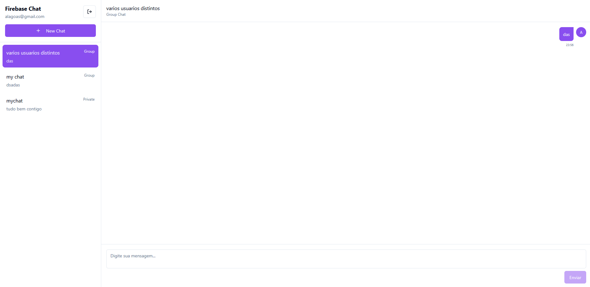

# Firebase Chat - Social Chat Application

A real-time chat application built with React, TypeScript, and Firebase Realtime Database.

## Features

- **User Authentication**: Email/password authentication with Firebase
- **Chat Types**:
  - Private chats (1:1 conversations)
  - Group chats (multiple participants)
  - Public chats (visible to all users)
- **Real-time Messaging**: Messages appear instantly using Firebase Realtime Database
- **Image Sharing**: Upload and share images in conversations
- **Message Timestamps**: All messages include readable timestamps
- **Responsive Design**: Works on mobile and desktop devices

## Technologies Used

- React
- TypeScript
- Firebase (Authentication, Realtime Database, Storage)
- Tailwind CSS
- shadcn/ui components

## Setup and Installation

1. Clone this repository
2. Install dependencies:
   ```
   npm install
   ```
3. Run the development server:
   ```
   npm run dev
   ```
4. Open [http://localhost:8080](http://localhost:8080) in your browser

## Firebase Configuration

This project uses Firebase for authentication, real-time database, and storage. The Firebase credentials are already configured in the application.

## Project Structure

- `/src/components/Auth`: Authentication components
- `/src/components/Chat`: Chat-related components
- `/src/contexts`: React context providers
- `/src/pages`: Application pages/routes
- `/src/firebase`: Firebase configuration
- `/src/types`: TypeScript type definitions

## Usage Instructions

1. Register a new account or login with existing credentials
2. Create a new chat (private, group, or public)
3. Send messages in real-time
4. Upload images using the paperclip icon
5. View all your chats in the sidebar

## Images

### Register Page


### Login Page


### Chats



### Create New Chat


